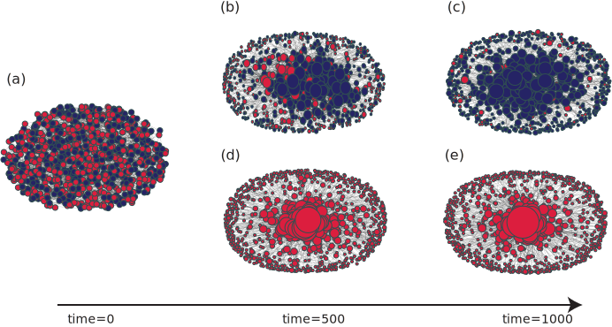
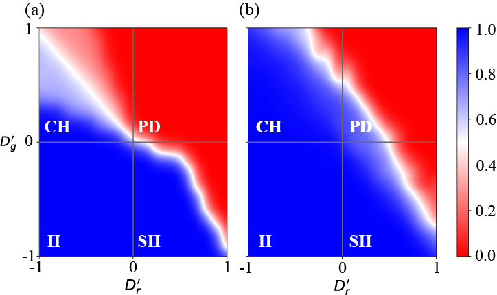

# ReputationRL-Coop
This repo contains an implementation of [Colaboratory notebook](https://colab.research.google.com/github/itstyren/reputationRL-coop/blob/main/reputationRL_coop_figures.ipynb), which loads the data from the simulation and reproduces the experimental results presented in the paper titled: ['Reputation-based Interaction Promotes Cooperation with Reinforcement Learning'](https://doi.org/10.1109/TEVC.2023.3304911).

The notebook showcases the entangled coevolutionary dynamics, coupled with strategy and topological evolution, and provides clear illustrations and explanations of these processes. The entangled coevolutionary dynamics combined with strategy and topological evolution are illustrated and described as below:

<p align="center">

</p>


# Setup and Usage
Execute the cells of the Colab in order. 
> Be aware that loading data might necessitate Google Drive authorization.


# Experimental Results
The graphs below depict the outcomes of various experiments. For more comprehensive details, please refer to the original paper.

**Snapshots of structure and strategy for a small subset of individuals from the entire  population**

<p align="center">

</p>

**Equilibrium fraction of cooperators in $D_r'-D_g'$ diagrams**
<p align="center">

</p>


# Paper citation
```text
@ARTICLE{10215365,
  author={Ren, Tianyu and Zeng, Xiao-Jun},
  journal={IEEE Transactions on Evolutionary Computation}, 
  title={Reputation-Based Interaction Promotes Cooperation With Reinforcement Learning}, 
  year={2024},
  volume={28},
  number={4},
  pages={1177-1188},
  doi={10.1109/TEVC.2023.3304911}}
```
